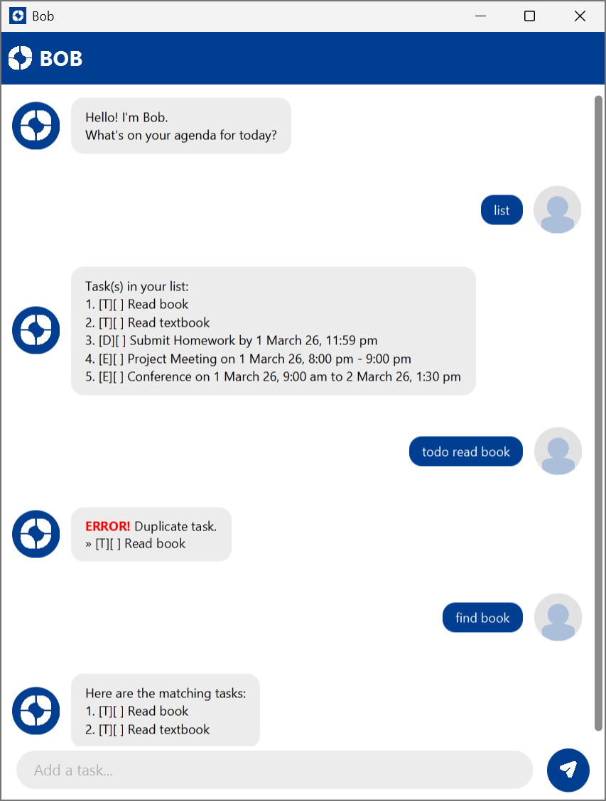

# Bob User Guide
<a name="image-anchor-point"></a>



Bob (Task Management Chatbot) is a **desktop task management application with a graphical user interface (GUI)** 
that allows users to manage tasks efficiently using typed commands. 
Tasks are automatically saved, ensuring your progress is preserved across sessions.

## Features


## Listing all tasks: `list`

Displays all tasks currently stored in Bob's task list.

Example: `list`

## Adding todos: `todo`

Creates a new to-do task and adds it to Bob's task list.

Format: `todo DESCRIPTION`

Example: `todo Read Book`

Displays the update to Bob's task list with task type, [T] and status []

```
To-Do task added: [T][] Read Book
```
## Adding deadlines: `deadline`

Creates a new deadline task and adds it to Bob's task list.

Format: `deadline DESCRIPTION DUE_DATE TIME`

Example: `deadline Submit Homework 1/3/26 2359`

Displays the update to Bob's task list with task type, [D] and status [].

```
Deadline task added: [D][] Submit Homework by 1 March 26, 11:59 pm
```

## Adding events: `event`

Creates a new event task and adds it to Bob's task list.

Format: `event DESCRIPTION START_DATE START_TIME END_DATE END_TIME`

### Similar Start Date and End Date:

Example: `event Project Meeting 1/3/26 1800 1/3/26 1900`

Displays the update to Bob's task list with task type, [E] and status [] and prints 1 date.

```
Event added: [E][] Project Meeting on 1 March 26, 6:00 pm - 7:00 pm
```

### Different Start Date and End Date:

Example: `event Conference 1/3/26 0900 2/3/26 1730`

Displays the update to Bob's task list with task type, [E] and status [].

```
Event added: [E][] Conference on 1 March 26, 9:00 am to 2 March 26, 5:30 pm
```

## Deleting a task: `delete`

Deletes specified task in Bob's task list.

Format: `delete INDEX`

- Deletes the task at specified `INDEX`.
- Index refers to the index number displayed in Bob's [task list](#image-anchor-point).
- Index **must be a positive integer** from '1' onwards.

Example: `delete 1`

Displays task removed from Bob's task list with task description.

```
Deleted: Read book
```

## Clearing all tasks: `clear`

Deletes all tasks in Bob's task list.

Example: `clear`

Displays update to Bob's task list.

```
Deleted all tasks.
```

## Marking a task: `mark`

Marks specified task in Bob's task list.

Format: `mark INDEX`

- Marks the task at specified `INDEX`.
- Index refers to the index number displayed in Bob's [task list](#image-anchor-point).
- Index **must be a positive integer** from '1' onwards.

Example: `mark 1`

Displays update to Bob's task list with task type, [`TYPE`] and status [X].

```
Task marked done: [T][X] Read book
```

## Unmarking a task: `unmark`

Unmark specified task in Bob's task list.

Format: `unmark INDEX`

- Unmark the task at specified `INDEX`.
- Index refers to the index number displayed in Bob's [task list](#image-anchor-point).
- Index **must be a positive integer** from '1' onwards.

Example: `unmark 1`

Displays update to Bob's task list with task type, [`TYPE`] and status [].

```
Task unmarked: [T][] Read book
```

## Finding tasks: `find`

Find tasks that have descriptions matching the given keyword.

Format: `find KEYWORD`

- The search is case-insensitive. e.g. `book` matches `Book`.
- Only the description is searched.
- Partial words are matched. e.g. `book` matches `textbook`.

Example: `find book`

Displays tasks in Bob's task list which have descriptions that match the given keyword.

```
Here are the matching tasks:
1.[T][] Read book
2.[T][] Read textbook
```

## Exiting the program: `bye`

Exits the program.

Format: `bye`

```
Bye!
```